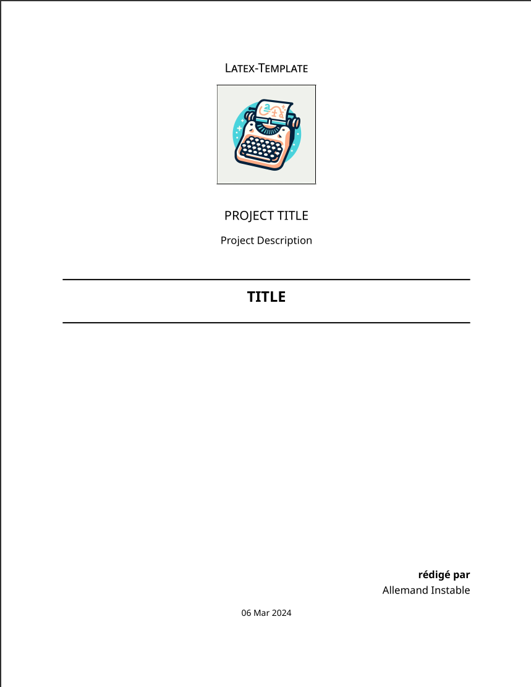
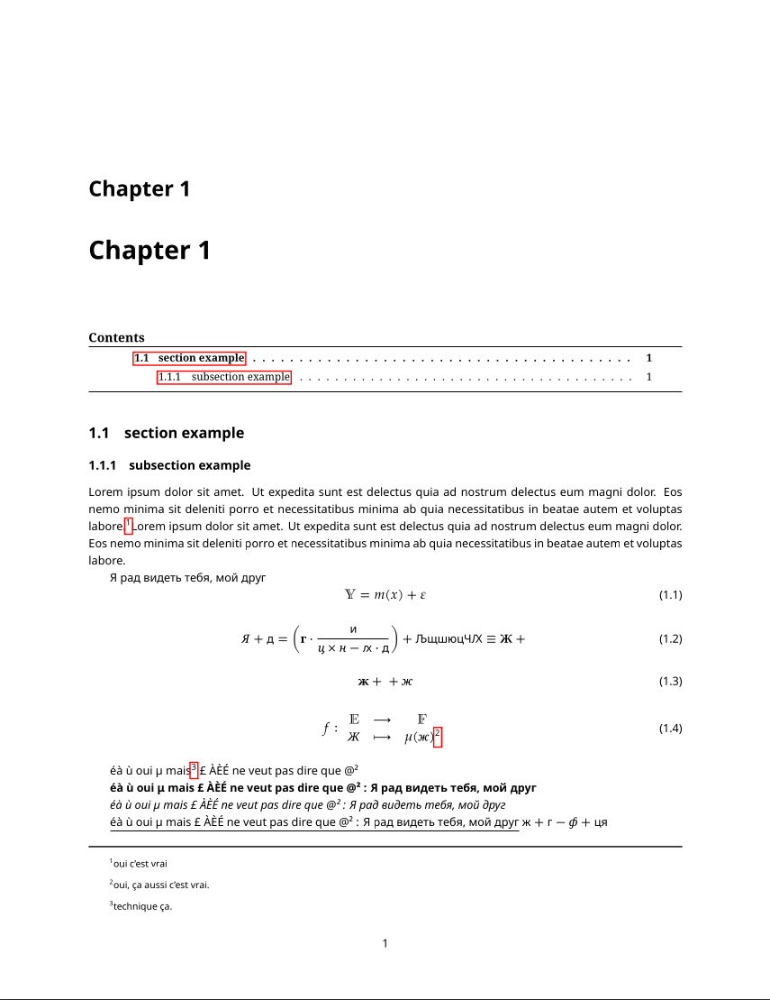
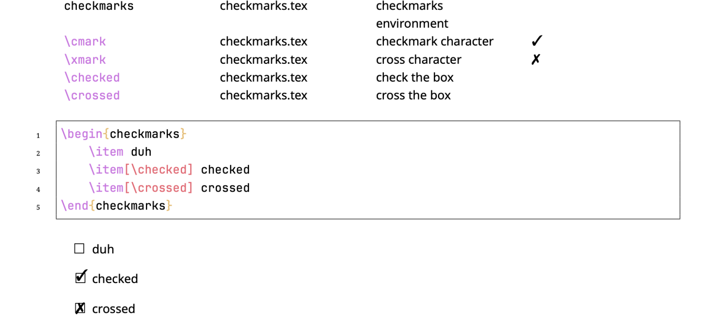
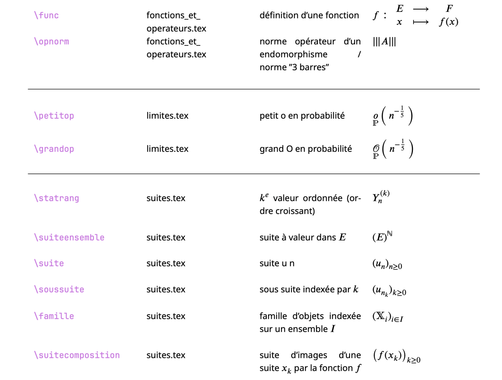

# LaTeX Template


A simple LaTeX Template, with nice structure, and commands for ease of use

<div>

    
</div>


## Requirements / Dependencies


<a  href="https://github.com/ohmyzsh/ohmyzsh/wiki/Installing-ZSH">
    
</a>
<a  href="https://mg.readthedocs.io/latexmk.html">
    
</a>
<br/>
<a  href="https://www.luatex.org">
    
</a>
<a  href="https://ctan.org/pkg/pdftex">
    
</a>

| software           | what for ?                                                        | installation link                                                        |
| ------------------ | ----------------------------------------------------------------- | ------------------------------------------------------------------------ |
| latexmk            | compile with complex options and watch for changes                | [official doc](https://mg.readthedocs.io/latexmk.html)                   |
| zsh [for now]      | shell targeted for the scripts "compile", "clear_aux" and "watch" | [oh-my-zsh tuto](https://github.com/ohmyzsh/ohmyzsh/wiki/Installing-ZSH) |
| latex              | seems obvious                                                     | [official doc](https://www.latex-project.org/get/)                       |
| [linux] evince     | pdf viewer                                                        |                                                                          |
| [macos] skim       | pdf viewer                                                        | [official website](https://skim-app.sourceforge.io/)                     |
| [windows] gsview32 | pdf viewer                                                        |                                                                          |

### why LuaTex ?

LuaTex supports utf-8 characters from the get go, which is nice when you want to use cyrillic letters as I do in my mathematics notations.


The integration of lua within latex allows for much more flexible documents, and sometimes coding in latex much faster, for instance if you want to input `name-[number].tex` files and then modify, add new files, remove some, ... It is much easier to just modify the range rather than deleting or adding complete lines on `\input{...}` :

```latex
\ifluatex
    % with luatex
    \begin{luacode*}
        for i = 1, 7 do
            local filename = "doc/maths/cmd_maths-" .. i .. ".tex"
            tex.sprint("\\input{" .. filename .. "}")
        end
    \end{luacode*}    
\else
    % without luatex
    \input{doc/maths/cmd_maths-1.tex}
    \input{doc/maths/cmd_maths-2.tex}
    \input{doc/maths/cmd_maths-3.tex}
    \input{doc/maths/cmd_maths-4.tex}
    \input{doc/maths/cmd_maths-5.tex}
    \input{doc/maths/cmd_maths-6.tex}
    \input{doc/maths/cmd_maths-7.tex}
\fi
```

## compiling and watching using `latexmk` :

<a  href="https://mg.readthedocs.io/latexmk.html">
    
</a>

➤ efficient way to compile and watch for changes in your LaTeX files

If you use zsh (which I do) : [or just copy paste what's inside into your terminal]

```zsh
zsh compile.zsh
```

```zsh
zsh watch.zsh
```

### flags

```zsh
# —— compile & watch flags ———
zsh compile.zsh -r      # compiles report only
zsh compile.zsh -a      # compiles article only
zsh compile.zsh -ra     # compiles article combined with report
zsh compile.zsh -d      # compiles documentation only
zsh compile.zsh -t      # compiles tests only
zsh compile.zsh -h      # flags help
# —— Exclusive to compile ———
zsh compile.zsh         # compile all files (doc/report/test)
```

The same applies to watch script

### other shells

if you use another shell (bash/...) you might have to adapt the script [chatGPT if you are hurry] to the targeted shell.

## project structure

```
📦LaTeX-Template
 ┣ 📂aux_files              ‹◀ latex compiling aux files (cache)
 ┣ 📂doc                    ‹◀ github README
 ┣ 📂out                    ‹◀ compiled files
 ┃ ┣ 📜documentation.pdf
 ┃ ┣ 📜rapport.pdf
 ┃ ┣ 📜tests.pdf
 ┣ 📂src                    ‹◀ actual project source code
 ┣ 📜.latexmkrc             ‹◀ compile settings
 ┣ 📜clear_aux.zsh
 ┣ 📜compile.zsh
 ┗ 📜watch.zsh
```

## documentation

<div>

    
</div>

The documentation [can be accessed easily in a pdf format](./out/documentation.pdf) at the location :

```
📦LaTeX-Template
 ┣ 📂out                    ‹◀ compiled files
 ┃ ┣ 📜documentation.pdf        ← formatted custom commands and settings documentation
 ┃ ┣ 📜rapport.pdf
 ┃ ┣ 📜tests.pdf
```

(⚠️ incomplete, for now use the pdf) If the user prefers in a markdown format : it can be found [here](./doc/doc.md) (📁 `doc/doc.md`)

## testing

```
📦LaTeX-Template
 ┣ 📂out                    ‹◀ compiled files
 ┃ ┣ 📜documentation.pdf
 ┃ ┣ 📜rapport.pdf
 ┃ ┣ 📜tests.pdf                ← testing commands and environments
```

## Packages :


 <!-- TODO -->

The project `Latex-Template` relies on the following latex packages to provide a better tex experience :

| Package      | Used For                                                            | `include/pacakges/` |
| ------------ | ------------------------------------------------------------------- | ------------------- |
| lualatex     | latex engine (utf-8 : cyrillic characters in math mode)             | -                   |
| ifluatex     | import and define stuff depending on the engine used (lua/pdf)latex | base.tex            |
| —            | —                                                                   | —                   |
| inputenc     | utf-8 input for pdflatex engine (if used)                           | base.tex            |
| fontenc      | font encoding                                                       | base.tex            |
| —*—          | —*—                                                                 | —*—                 |
| graphicx     | including images                                                    | base.tex            |
| —*—          | —*—                                                                 | —*—                 |
| amsmath      | maths                                                               | base.tex            |
| amssymb      | maths symbols                                                       | base.tex            |
| stmaryrd     | symbols for computer science                                        | base.tex            |
| amsthm       | theorem environments                                                | theorem_styles.tex  |
| mathtools    | convenient convergence arrows                                       | base.tex            |
| —*—          | —*—                                                                 | —*—                 |
| hyperref     | url links with custom text                                          | base.tex            |
| url          | typesetting URLs                                                    | base.tex            |
| —*—          | —*—                                                                 | —*—                 |
| babel        | french names for envs                                               | base.tex            |
| —*—          | —*—                                                                 | —*—                 |
| multicol     | typesetting documents with multiple columns                         | base.tex            |
| multirow     | table cells spanning multiple rows                                  | base.tex            |
| —*—          | —*—                                                                 | —*—                 |
| minitoc      | table of content of the chapter                                     | base.tex            |
| —*—          | —*—                                                                 | —*—                 |
| xcolor       | custom colors                                                       | base.tex            |
| float        | improved interface for floating objects                             | base.tex            |
| —*—          | —*—                                                                 | —*—                 |
| table        | tables                                                              | base.tex            |
| xcdraw       | drawing tables with TikZ                                            | base.tex            |
| array        | extending the array and tabular environments                        | base.tex            |
| tabularx     | beautiful tables with adjustable-width column                       | base.tex            |
| booktabs     | publication quality tables                                          | base.tex            |
| —*—          | —*—                                                                 | —*—                 |
| algorithm2e  | algorithm environments                                              | base.tex            |
| comment      | commenting out large blocks of code with env                        | base.tex            |
| —*—          | —*—                                                                 | —*—                 |
| tikz-cd      | creating commutative diagrams                                       | base.tex            |
| tikz         | creating graphics programmatically                                  | base.tex            |
| pgfplots     | latex curve graphs                                                  | base.tex            |
| —*—          | —*—                                                                 | —*—                 |
| footmisc     | make sure footnotes are bellow                                      | base.tex            |
| geometry     | page margin dimensions                                              | base.tex            |
| pdfpages     | include PDF documents                                               | base.tex            |
| —            | —                                                                   | —                   |
| dsfont       | double stroke : better than `\mathbb`                               | fonts.tex           |
| avant        | font (used for pdflatex sans serif font)                            | fonts.tex           |
| fontawesome5 | icons [`\info` / `\warn` ...]                                       | fonts.tex           |
| mfirstuc     | capitalizing the first letter of a word                             | fonts.tex           |
| ulem         | emphasis is now underline                                           | fonts.tex           |
| unicode-math | cyrillic letters in math mode                                       | fonts.tex           |
| —            | —                                                                   | —                   |
| framed       | framed or shaded regions that can break across pages                | others.tex          |
| awesomebox   | env with bar at the left [`\info` / `\warn` ...]                    | others.tex          |
| changepage   | margin adjustment and detection of odd/even pages                   | others.tex          |
| enumitem     | create custom enum environments                                     | others.tex          |
| pifont       | checkmarks for `checkmarks` environment                             | others.tex          |
| datetime     | advanced time formatting and date commands                          | others.tex          |
| —            | —                                                                   | —                   |
| shellesc     | pygmentize call must use console commands                           | minted.tex          |
| minted       | code highlight                                                      | minted.tex          |
---

## Quick accesses to some settings

### babel language :

- original setting : english

```zsh
code --goto src/include/packages/base.tex:14:19
```

### margin dimensions

- original settings : 
    - top : 1.5cm
    - bottom : 1.5cm
    - margin : 2.5cm

```zsh
code --goto src/include/packages/base.tex:40
```

### Project & Render Settings

```zsh
code --goto src/include/settings/project.tex
```

```zsh
code --goto src/include/settings/render.tex
```